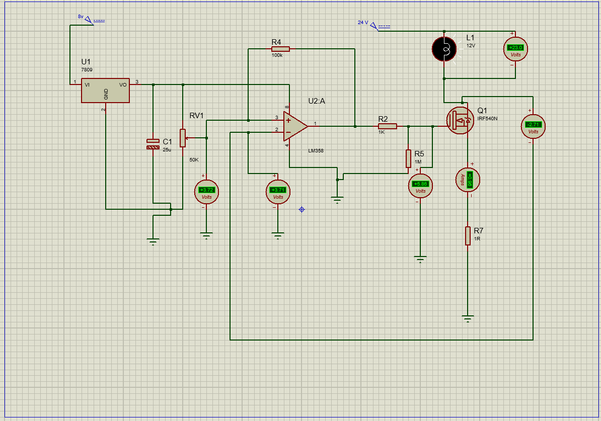

# Over-Current Protection Circuit
### LM358 Comparator · IRF540N MOSFET · Shunt Resistor

---

## 📘 Overview
This project implements an analog **over-current protection circuit** using an **LM358 op-amp** as a comparator.  
A 1Ω shunt resistor senses current, and when the current exceeds the preset threshold set by RV1, the comparator output turns OFF the load using an IRF540N MOSFET.

---

## 🎯 Features
- Real-time current monitoring  
- Adjustable trip point  
- LM358 comparator-based design  
- MOSFET-based switching  
- Simple, low-cost, and reliable  

---

## 🧰 Components Required

| Component | Specification |
|----------|---------------|
| LM358 | Comparator |
| IRF540N | Power MOSFET |
| Shunt Resistor | 1Ω |
| RV1 | 50kΩ |
| 7809 | Voltage Regulator |
| Capacitor | 25µF |
| Load | 12V Lamp / Motor |
| Supply | 24V (Load), 9–12V (Control) |

---
## Circuit Diagram

##  Working Principle
The shunt resistor generates a small voltage proportional to load current:
Vsense = I × Rshunt

LM358 compares:
- **Vsense** → Non-inverting (+)
- **Vref** (RV1) → Inverting (–)

### Trip Logic:
Vsense < Vref → Load ON

Vsense > Vref → Load OFF (Trip)
##  Result
The circuit successfully detects over-current and disconnects the load through MOSFET control when the sensed current exceeds the preset reference threshold.

